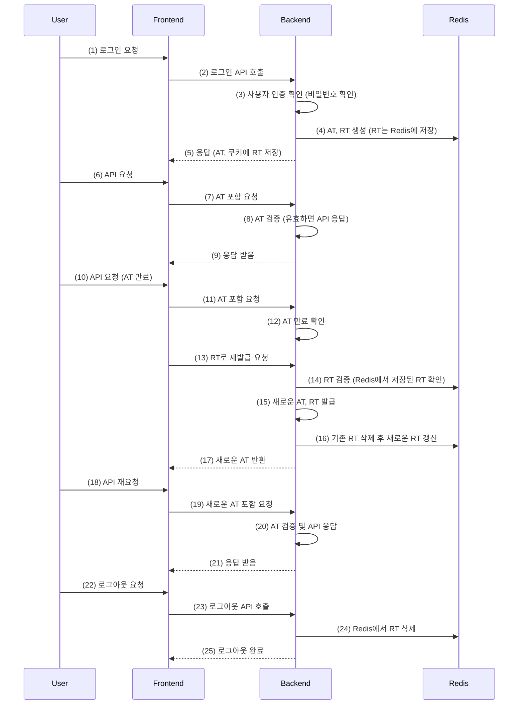

# 🧩 DECOBET v2(TEC-WEB-Project) - 주니어 개발자를 위한 코드 번역기 (리빌딩 - 개인 프로젝트)

## 📌 프로젝트 소개
**DECOBET v2**는 코드 해석에 어려움을 겪는 **주니어 개발자**들을 위해 개발된 **코드 번역 웹 애플리케이션**입니다.  
기존 팀 프로젝트(Third-WEB-Project)를 기반으로 **보안 강화, 구조적 개선, 기능 확장**을 목표로 **새롭게 리빌딩**하였습니다.

### 📅 프로젝트 기간 : 2025년 02월 07일 ~ 2025년 02월 28일 (진행 중)
- 이 프로젝트는 팀 프로젝트(Third-WEB-Project) 조기 종료로 리빌딩한 프로젝트입니다.

### ✅ 기존 프로젝트와의 차별점
- **Spring Security & JWT 보안 강화** → JWT RTR(Rotating Refresh Token) 전략 적용, XSS/MITM 방어</li>
- **IP 기반 API 접근 제한** → 비회원도 번역 기능 사용 가능, <b>IP 기반 요청 제한 적용</b></li>
- **데이터 구조 최적화** → 기존 DB 설계 개선, 쿼리 최적화</li>
- **UX/UI 개선** → 기존 HTML, CSS에서 React-Bootstrap을 활용한 반응형 UI 적용</li>
- **계층형 1:1 문의 기능** → 트리 구조의 답글을 지원하여 사용자 피드백 수집 최적화</li>
</ul>

## 🛠 기술 스택
### 💾 Backend
- **Java 17 / Spring Boot 3.4**
- **Spring Security + JWT RTR**
- **JPA (Hibernate)**
- **MySQL / Redis**
- **RESTful API** 설계 및 구현

### 🎨 Frontend
- **React 18 / JavaScript**
- **React-Bootstrap** (UI 개선)
- **Axios**

### ⚙ DevOps & 기타
- **GitHub Actions (CI/CD)**
- **Junit & Mockito (TDD)**
- **Postman API 테스트**

---

## 🔥 주요 기능

### 🏠 메인 기능: 코드 번역
- 사용자가 **입력한 코드** 또는 **파일 업로드**를 통해 **코드를 번역**
- 코드의 기본 자료형, 메소드, 상수 등을 **이해하기 쉬운 한글로 변환**
- 다양한 프로그래밍 언어 지원 (Java, Python, JavaScript 등 확장 가능)

### 📜 번역 기록 관리
- **이전 번역 내역 조회** 및 **검색 기능** 제공
- 번역된 결과를 **TXT 파일로 다운로드 가능**
- 사용자의 최근 번역 기록을 **DB 및 SessionStorage에 저장**

### 🔒 **보안 & 사용자 인증**
- **JWT RTR 전략 적용 (Access Token + Refresh Token)**
  - Refresh Token을 Redis에 저장하여 **재사용 방지 및 보안 강화**
  - Refresh Token이 **재사용되면 즉시 강제 로그아웃 처리**
- **CSRF/XSS 방어 적용**
  - **Secure HttpOnly Cookie** 사용 (Refresh Token 보호)
  - **SameSite=Strict 설정**으로 CSRF 방어
 
### 🌐 **비회원 번역 기능 (IP 기반 요청 제한)**
- **비회원도 제한적으로 번역 기능 사용 가능**
- **회원과 비회원의 API 접근 방식 차별화**  
  - **회원 (JWT 인증)** → 로그인 후 **무제한 번역 가능**  
  - **비회원 (IP 기반 제한 적용)** → 하루 **30회 번역 요청 가능**
- **IP 기반 요청 제한 방식**
  - IP 별 요청 횟수를 저장 (`Ip.java` 엔티티 활용)
  - **`/api/ip/validate`** API를 통해 요청 가능 여부 확인 (`IpController.java`)
  - 하루 단위로 요청 횟수 초기화 (`IpResetService.java`)

### 📩 **1:1 문의 기능 (계층형 답글 지원)**
- **사용자 문의 등록, 수정, 삭제 가능**
- **관리자 & 사용자 간 트리 구조 답글 지원**
- **문의 진행 상태 (대기, 진행 중, 완료) 관리**

---

# 🚀 Stacks

 
  

 
     
  
  
  
   

 
  
   
  
   

 
  
  
  
  
   

---

## 🔐 **JWT RTR (Rotating Refresh Token) 전략**
기존의 단순 JWT 인증 방식에서 **JWT RTR 전략**을 적용하여 보안을 강화하였습니다.  

✅ **RTR 전략 적용 후 보안 개선점**  
- Refresh Token을 Redis에 저장하여 **재사용 감지**  
- Refresh Token이 탈취되거나 재사용되면 **모든 세션 강제 만료**  
- **Secure & HttpOnly Cookie 저장**으로 XSS/MITM 공격 방어  

### 📜 **JWT RTR 인증 과정 (시퀀스 다이어그램)**  

---

### 🚫 미완료 기능
#### 📝 OAuth 2.0 인증 로그인 
- 사용자 계정의 안전성을 확보하기 위해 SMS 인증 API를 활용한 기능 추가
---

### 🔗보완할 점
#### 📝 OAuth 2.0 인증 로그인 
- 구글, 네이버, 카카오 등을 통한 로그인이 가능하게 개방형 표준 프로토콜 적용

#### 📝 프론트엔드 CSS 보완
- ROUTE별 컴포넌트 CSS 추가작업 필요
